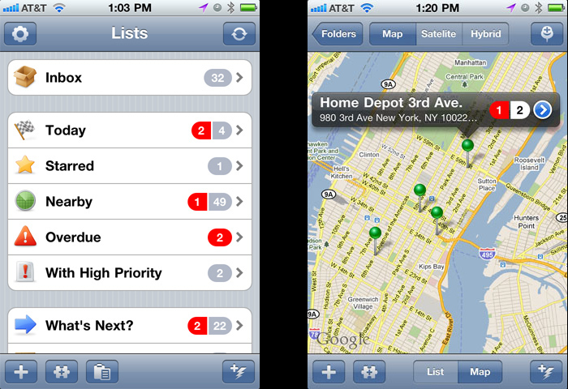
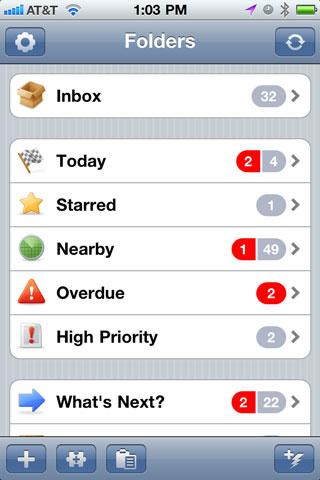
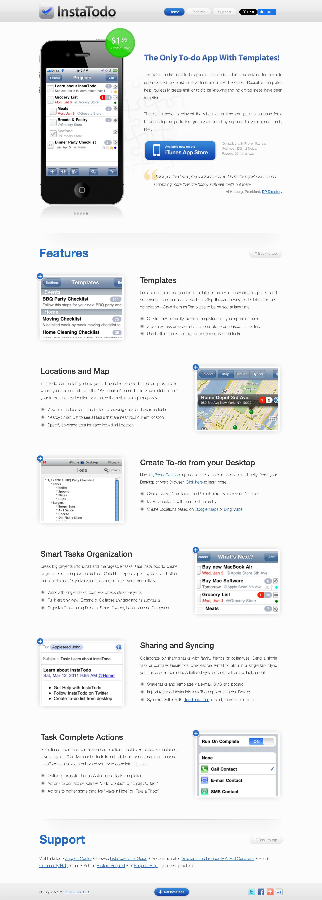
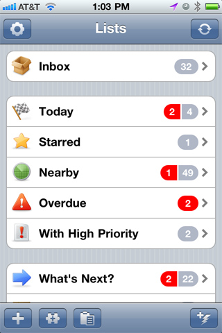
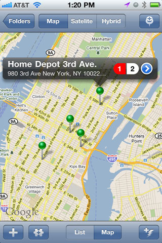
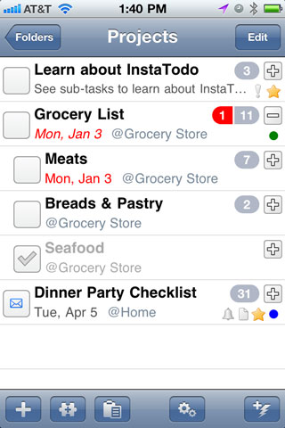
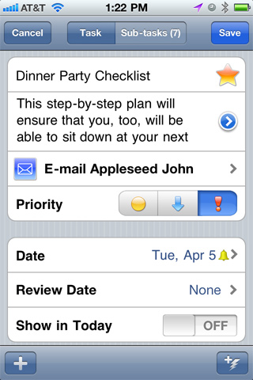
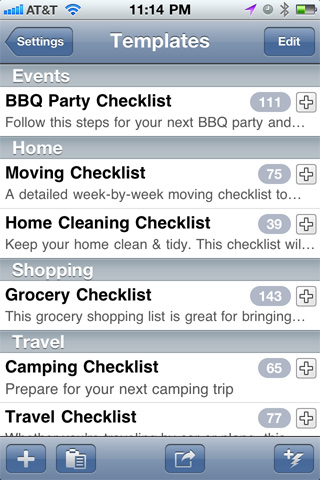

# Portfolio Overview | InstaTodo

**Grygoriy Ledenyov**

_Lead Software Architect | Lead Software Developer_

Stamford, CT | [gregory.ledenev37@gmail.com](mailto:gregory.ledenev37@gmail.com) | 914-334-5857

LinkedIn: https://www.linkedin.com/in/ledenev/

GitHub: https://github.com/gregory-ledenev

## InstaTodo

InstaTodo - the only ToDo app with templates. Templates make InstaTodo special! InstaTodo adds customized Templates to
sophisticated to-do list to save time and make life easier. Reusable Templates help you easily create task or to-do list
knowing that no critical steps have been forgotten.

There’s no need to reinvent the wheel each time you pack a suitcase for a business trip, or go to the grocery store to
buy supplies for your annual family BBQ.

InstaTodo can instantly show you all available to-do’s based on proximity to where you are located. Use the "By
Location" smart list to view distribution of your to-do tasks by location or visualize them all in a single map view.

To simplify making to-do lists - use myPhoneDesktop application to create a to-do lists directly from your Desktop or
Web Browser.

Break big projects into small and manageable tasks. Use InstaTodo to create a single task or complex hierarchical
Checklist. Specify priority, date and other tasks’ attributes. Organize your tasks and improve your productivity.

Collaborate by sharing tasks with family, friends or colleagues. Send a single task or complex hierarchical checklist
via e-mail or SMS in a single tap. Sync your tasks with Toodledo.

Sometimes upon task completion, some action should take place. For instance, if you have a "Call Mechanic" task to
schedule an annual car maintenance, InstaTodo can initiate a call when you try to complete this task.
- Option to execute desired Action upon task completion
- Actions to contact people like “SMS Contact” or “Email Contact”
- Actions to gather some data like “Make a Note” or “Take a Photo”

## Screenshots:

