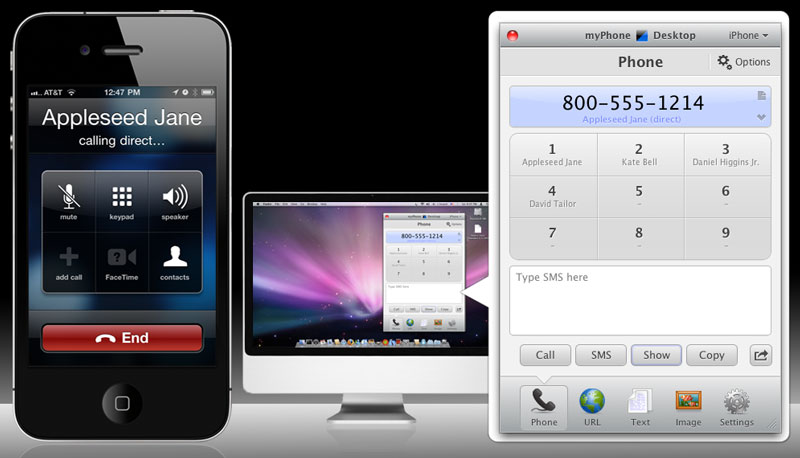
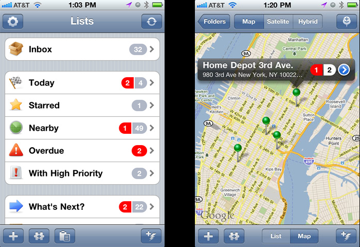
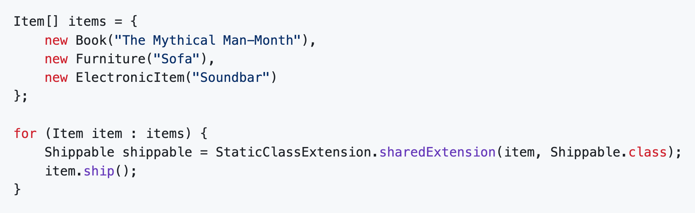
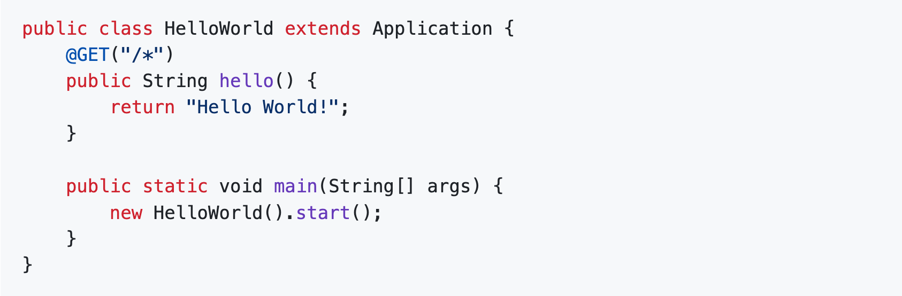

# Portfolio Overview

**Grygoriy Ledenyov**

_Lead Software Architect | Lead Software Developer_

Stamford, CT | [gregory.ledenev37@gmail.com](mailto:gregory.ledenev37@gmail.com) | 914-334-5857

LinkedIn: https://www.linkedin.com/in/ledenev/

GitHub: https://github.com/gregory-ledenev

The following is a brief description of major commercial applications, products, libraries and frameworks I’ve designed
and developed.

iOS Apps:
- [Alloy - Launcher and Automator](#alloy---launcher-and-automator)
- [myPhoneDesktop](#myphonedesktop)
- [InstaToDo](#instatodo)

Embedded, Desktop and Server:
- [Protection! Licensing Toolkit](#protection-licensing-toolkit)

Developer Productivity and Libraries:
- [Productivity! For JBuilder](#productivity-for-jbuilder)
- [Java Class Extension Library](#java-class-extension-library)
- [EasyRouting for Vert.x](#easyrouting-for-vertx)

## Alloy - Launcher and Automator

"Alloy - launcher and automator" is all about automating your day-to-day activities. Whether you just need to launch an
app or automate your workflow - Alloy makes it simple and handy with just one click. So, if you need to post today's
photos with added watermark to Facebook, send a canned message to someone, save and track your parking place and time,
automate Siri, use AI to work with texts and pictures etc. - just create corresponding Actions and use them again
and again. With Alloy, you can:

- Make small apps rather than workflows
- Perform some workflows in background
- Make your own widgets (glances)
- Use AI and Cloud services for your actions
- Make your own chat interfaces to any chat services
- Associate actions to NFC tags
- Process Siri requests in background and return graphical results back to Siri
- Launch your actions right form iMessage and share results with your contacts
- Associate reminders with actions
- Create Lists from templates on schedule or location change
- Debug your actions using breakpoints, inspectors, logs, etc.
- And much more!

"Alloy - launcher and automator" is suitable for any user. No matter who you are, a newbie, or an experienced user, you
will find Alloy handy and fun to play with. Newbies can easily make simple Actions in minutes just by defining a basic 
workflow combining several tasks together. Experienced users can build more sophisticated Actions using loops,
conditional operators, Web Services, workflow calls, etc.

"Alloy - launcher and automator" is wherever you need it. You can make Siri Shortcuts for any Alloy's Actions and then
launch those Actions from Siri by speaking certain phrases. It is even possible to make Siri Shortcuts that run in
background without leaving Siri... You can use Alloy right from Messages to share Action's result (e.g., tip calculation)
with friends. Or you can use Alloy's Widget in the Notification Center to get quick access to the Favorite Actions, etc.

"Alloy - launcher and automator" combines the best of two worlds:
Advanced launcher with dynamic favorites based on your habits, location, and usage statistics.
Sophisticated workflow engine, which allows building Actions using REST Web Services, system and Cloud services,
installed apps, etc.

Sample Actions that Alloy can do with just one click are:

- post today's photos with added watermark to Facebook
- calculate a tip
- send group SMS and email
- send canned SMS to someone
- save parking place and set up a reminder to leave
- find the best pizza place around on Yelp
- upload new photos to Dropbox and send links of them by email
- convert EUR to USD using Convertible
- navigate to a certain location using Google Map
- etc.

You can either use ready-to-use Actions from built-in Action Directory or build your own Actions using a simple yet
powerful Action Editor. Alloy allows you to create custom Actions that will meet your specific needs and desires. You
can customize Action's workflows, background, layout, colors, folders, and so much more! If you are ready to create your
first customized Action, take a look at our “Alloy Getting Started Guide” or ask our Support Team.

Alloy eliminates the need to browse through several pages full of apps to find an app or Action to launch - dynamic
Favorites provide you just with the right set of necessary apps and actions based on your habits, location, and usage
statistics. You can even use Siri Shortcuts to launch Actions by voice.

## Protection! Licensing Toolkit

Protection! - is a powerful multi-platform Licensing Toolkit and License Manager that provides the ability to add
licensing into custom applications or components only allowing the permitted use according to the supplied license.
Protection! uses high encryption technology and provides easy integration for software developers even for cross-platform products while being non-invasive for end users. Protection! License Manager offers a versatile solution for
any licensing model. Protection! is adopted and appreciated by Fortune 500 companies including GM, LG, Siemens, General
Dynamics and Lockheed Martin and others.

Protection! allows software vendors, publishers and developers to:

- Add licensing to Web, Enterprise, Server and Desktop applications.
- Provide users with the trial versions of their products.
- Significantly minimize or completely reduce unauthorized use of their applications and therefore dramatically increase
  company revenue.
- Increase revenue streams by implementing various licensing models while maintaining a single code base and therefore
  offering higher flexibility to their customers.
- Track concurrent license usage and manage their customer base.

### Protection! Benefits

With the help of Protection! Licensing Toolkit and License Manager software publishers and developers are able to:

- Easily and economically increase the scalability of their applications.
- Have full control over all aspects of licensing and tracking.
- Enable additional revenue generation models.
- Quickly and easily adapt Protection! to any business model.
- Implement robust licensing features into their applications while providing an easy and non-invasive environment to
  their end users.
- Solve today's complex licensing challenges.
- Prevent users' ability to make either unintentional or unauthorized copies.
- Free development resource to work on the core functionality that makes their application great.

Protection! Licensing Toolkit contains the following products:

### Protection Developer

Provides a framework to add licensing support into applications; ability to develop custom backend implementations as
well as basic license generation functionality.

### Protection Enterprise

Complete turnkey solution designed to bring real value to software publishers by providing full automation of licensing
processes together with management of licenses, customers, and evaluators.

### Protection Sales

Provides advanced functionality for license generation, maintenance, and license delivery.

### Protection Licensing Server

Provides an ability to distribute licenses on-demand and track their concurrent use according to the Named or Floating User
Licensing Models.

## myPhoneDesktop

myPhoneDesktop provides an easy and effective way to work with your iPad, iPhone or iPod touch directly from your
desktop. Whether you need to make a phone call, send a long SMS, copy a large amount of text, send a long and
complicated to retype URL, open route in mobile Google Map, or store an image on your iPad or iPhone, myPhoneDesktop
greatly streamlines your workflow.

Use Desktop client, which tightly integrates with your OS (Windows, Mac OS or Linux) and provides such handy features
like Drag & Drop, global shortcuts like Cmd+C+C and plugin's to popular applications like LaunchBar or Apple Address
Book.

If you are on-the-go or not at your own computer (Hotel, Internet Cafe or Local Library), you can use a convenient and
full-featured myPhoneDesktop Web Client that works in numerous browsers. You can also use myPhoneDesktop Bookmarklet and
send any content from any Webpage to your iPhone/iPod touch with ease! See something you like while browsing the Web? 
Select it and click the "Send to myPhoneDesktop" Bookmarklet then check your iPhone to receive selected content.

Business users would appreciate seamless integration with SalesForce, which provides an ability to Call and SMS to Leads,
Accounts and Contacts using iPhone.

## InstaTodo

InstaTodo - the only ToDo app with templates. Templates make InstaTodo special! InstaTodo adds customized Templates to
sophisticated to-do list to save time and make life easier. Reusable Templates help you easily create task or to-do list
knowing that no critical steps have been forgotten.

There’s no need to reinvent the wheel each time you pack a suitcase for a business trip, or go to the grocery store to
buy supplies for your annual family BBQ.

InstaTodo can instantly show you all available to-do’s based on proximity to where you are located. Use the "By
Location" smart list to view distribution of your to-do tasks by location or visualize them all in a single map view.

To simplify making to-do lists - use myPhoneDesktop application to create a to-do lists directly from your Desktop or
Web Browser.

Break big projects into small and manageable tasks. Use InstaTodo to create a single task or complex hierarchical
Checklist. Specify priority, date and other tasks’ attributes. Organize your tasks and improve your productivity.

Collaborate by sharing tasks with family, friends or colleagues. Send a single task or complex hierarchical checklist
via e-mail or SMS in a single tap. Sync your tasks with Toodledo.

Sometimes upon task completion, some action should take place. For instance, if you have a "Call Mechanic" task to
schedule an annual car maintenance, InstaTodo can initiate a call when you try to complete this task.
- Option to execute desired Action upon task completion
- Actions to contact people like “SMS Contact” or “Email Contact”
- Actions to gather some data like “Make a Note” or “Take a Photo”

## Productivity! For JBuilder

Productivity! is a genuine and rich set of tools intended to greatly simplify routine coding and navigation operations.
As a result, it allows significantly greater development productivity. All Productivity! tools are carefully designed
and tuned to minimize efforts to invoke and use them so you can enjoy the friendly environment Productivity! offers.
With Productivity! tools:
- Be aware of any errors in your code and get assistance to fix them!
- Be always on schedule with help of Task List!
- Write bulletproof documentation for your code!
- Easily reuse your favorite code fragments!
- Write well-composed and easy maintainable code!
- Forget about typing your imports!
- Forget about annoying dialogs and Wizards while you are coding!
- Discover context and navigate through it!
- Use hyperlinks to surf and to get informed!
- Navigate freely through your classes, methods, fields and even editing points!
- Obtain quick help on classes and methods exactly where and when you need!
- Add super interfaces, change super classes in several simple steps!
- Override methods and constructors in a couple of clicks!
- Add access methods for you fields instantly!
- Use your own unique naming standards!
- And finally, forget that you are using Productivity! - just enjoy your favorite IDE, interesting work and your superior
performance!

## Java Class Extension Library

Java Class Extension Library - powerful library that emulates class extensions (categories) in Java. In addition, it
supports interfaces and object composition, interface adoption, object unions and aspects.

Class extensions (categories) are beneficial because they:
- Improve code organization by separating core data structures from specialized functionality.
- Enhance modularity, allowing domain-specific logic to be added without modifying original classes.
- Promote the Single Responsibility Principle by keeping data classes focused on data representation.
- Enable adding new features to existing types, including third-party or framework types.
- Facilitate better separation of concerns in complex applications.
- Improve code readability and maintainability.
- Allows adding aspects in addition to adding operations.

These benefits lead to more flexible, maintainable, and efficient code structures. Unfortunately, Java does not natively
support class extensions (categories) and there is a little chance such support is going to be introduced in the near
future. Java Class Extension library provides a valuable alternative for native class extensions with just a little more
verbose code and little more complex implementation.

The library supports the following approaches for creating of class extensions:

- **Static Class Extensions**: define and implement extensions as usual Java classes and then use the Java Class
  Extension library to find matching extensions.
- **Dynamic Class Extensions**: utilize the Java Class Extension library to define extensions by composing them as sets
  of lambda operations and let the library create extensions dynamically on the fly.

Both approaches leverage the ClassExtension interface, which facilitates querying for an extension based on an object's
extension interface. Once obtained, these extensions unlock additional functionality with remarkable ease.

Available at GitHub: https://github.com/gregory-ledenev/java-class-extension

## EasyRouting for Vert.x

EasyRouting is a lightweight, annotation-driven HTTP routing library designed to build Vert.x web applications. It
simplifies web development by letting you define routes with Java annotations—no need to manage complex request or
response objects.

Inspired by JAX-RS and Spring Boot’s routing style, EasyRouting provides a focused, minimal solution without the
heaviness of a full framework. It’s ideal for developers who want to build web apps quickly using just basic Java and
HTTP knowledge.

Key Highlights:
- Define routes and configuration using simple annotations on your Java methods.
- Automatic parameter binding and response handling.
- Use plain Java objects; no manual JSON serialization needed.
- Minimal setup; start by extending the Application class and calling start().
- Designed for easy learning with no need to learn Vert.x to get started.

Get started in minutes and build clean, maintainable web apps with less boilerplate code.

Available at GitHub: https://github.com/gregory-ledenev/Vert.x-EasyRouting