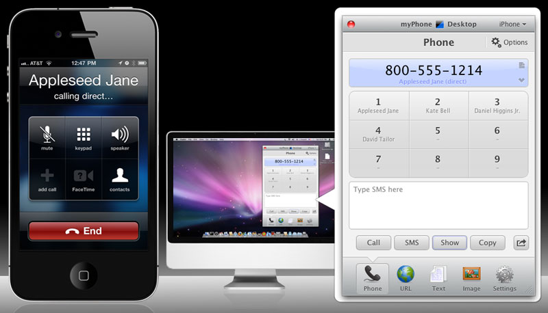
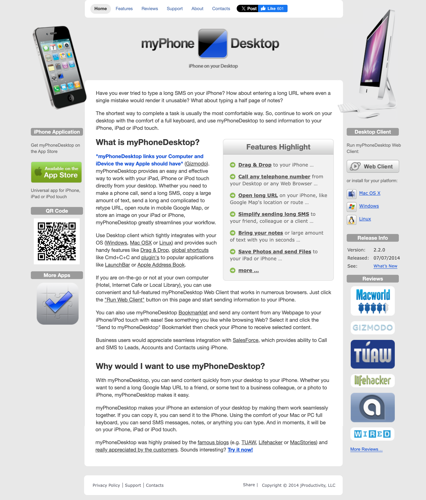
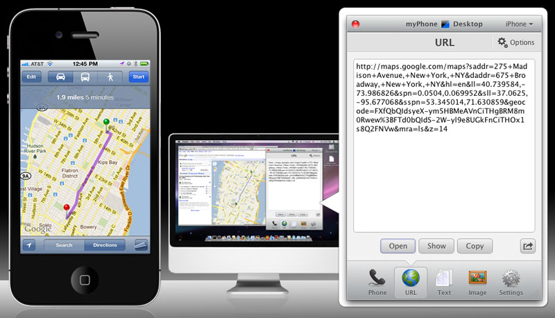
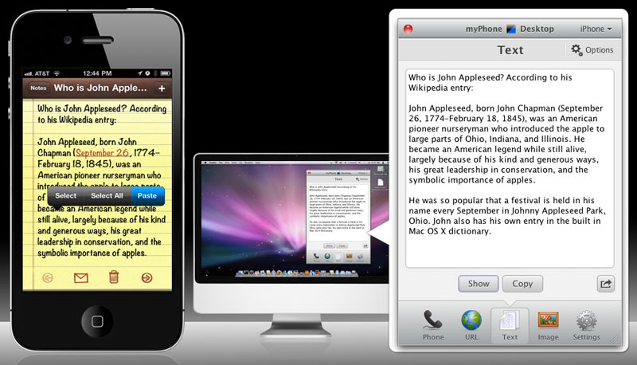
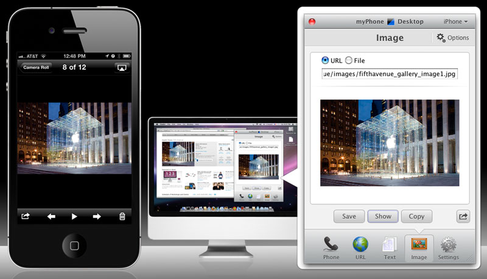
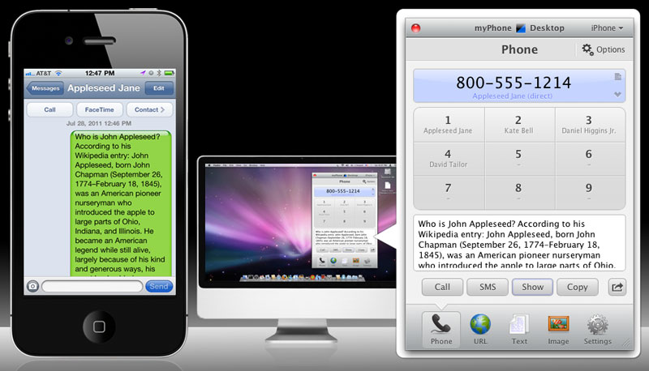
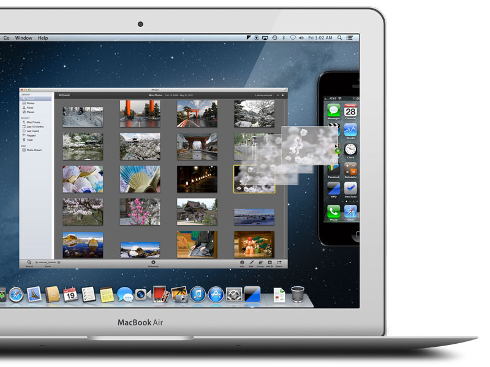

# Portfolio Overview | myPhoneDesktop

**Grygoriy Ledenyov**

_Lead Software Architect | Lead Software Developer_

Stamford, CT | [gregory.ledenev37@gmail.com](mailto:gregory.ledenev37@gmail.com) | 914-334-5857

LinkedIn: https://www.linkedin.com/in/ledenev/

GitHub: https://github.com/gregory-ledenev

## myPhoneDesktop

myPhoneDesktop provides an easy and effective way to work with your iPad, iPhone or iPod touch directly from your
desktop. Whether you need to make a phone call, send a long SMS, copy a large amount of text, send a long and
complicated to retype URL, open route in mobile Google Map, or store an image on your iPad or iPhone, myPhoneDesktop
greatly streamlines your workflow.

Use Desktop client, which tightly integrates with your OS (Windows, Mac OS or Linux) and provides such handy features
like Drag & Drop, global shortcuts like Cmd+C+C and plugin's to popular applications like LaunchBar or Apple Address
Book.

If you are on-the-go or not at your own computer (Hotel, Internet Cafe or Local Library), you can use a convenient and
full-featured myPhoneDesktop Web Client that works in numerous browsers. You can also use myPhoneDesktop Bookmarklet and
send any content from any Webpage to your iPhone/iPod touch with ease! See something you like while browsing the Web?
Select it and click the "Send to myPhoneDesktop" Bookmarklet then check your iPhone to receive selected content.

Business users would appreciate seamless integration with SalesForce, which provides an ability to Call and SMS to Leads,
Accounts and Contacts using iPhone.

## Screenshots:

